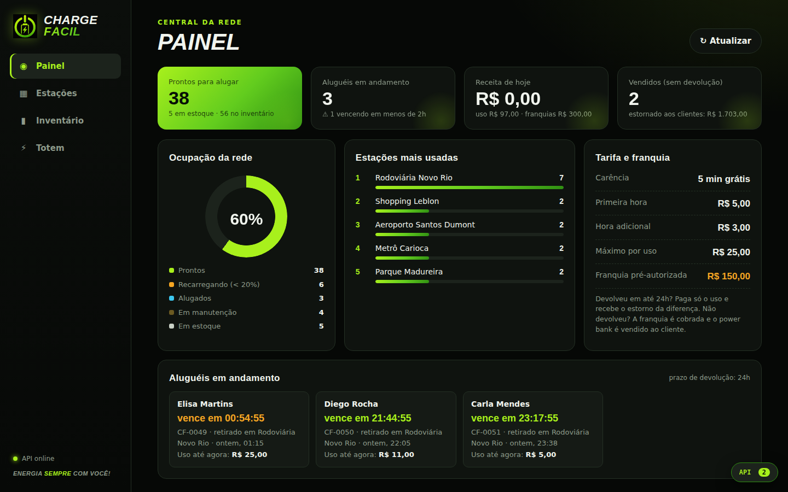
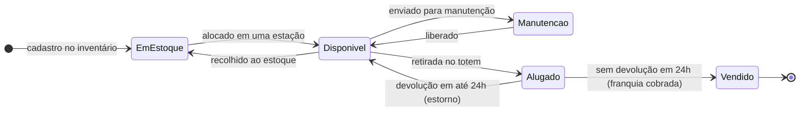
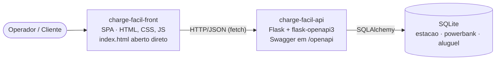

<p align="center">
  
</p>

<h1 align="center">Charge Fácil</h1>
<p align="center"><strong>Energia sempre com você!</strong><br>
Rede de estações de autoatendimento para aluguel de power banks: retire em uma estação e devolva em qualquer outra.</p>

<p align="center">
  MVP · Desenvolvimento Full Stack Básico · PUC-Rio<br>
  Python · Flask · SQLite · OpenAPI/Swagger · HTML · CSS · JavaScript
</p>

---

## 📌 Resumo executivo

**O problema.** A bateria do celular costuma acabar justamente longe de casa: no aeroporto, no shopping, no metrô,
no trajeto para o trabalho. Carregadores fixos prendem a pessoa a uma tomada, e comprar um power bank por impulso
é caro e pouco prático.

**A solução.** A Charge Fácil espalha **totens de autoatendimento** por pontos de grande circulação. O cliente
**aluga um power bank carregado em segundos, usa enquanto se desloca e devolve em qualquer estação da rede**.
Ele paga apenas pelo tempo de uso.

**O modelo de negócio.**

| Regra | Como funciona |
|---|---|
| Tarifa de uso | 5 min grátis · R$ 5,00 a primeira hora · R$ 3,00 por hora adicional · máximo de R$ 25,00 |
| Franquia (caução) | R$ 150,00 pré-autorizados no cartão na retirada |
| Devolução em até 24h | Cobra-se só o uso e **a diferença da franquia é estornada** |
| Sem devolução em 24h | A franquia é cobrada e o **power bank passa a ser do cliente** (vira venda) |

A franquia protege o ativo: o power bank sempre volta para a rede ou é pago integralmente.

**O MVP entrega** a operação completa da rede em duas aplicações independentes:

- **Central de gestão**:
  - painel de indicadores;
  - cadastro de estações;
  - inventário com ciclo de vida do power bank (estoque → estação → aluguel → devolução ou venda).
- **Simulador do app do totem**: fluxo de autoatendimento para alugar e devolver, com recibo e estorno.

<p align="center">
  
</p>

---

## 📦 Repositórios

O projeto é composto por **dois repositórios independentes**, conforme os requisitos do MVP. Este repositório reúne a apresentação do projeto:

| Repositório | Conteúdo | Link |
|---|---|---|
| **charge-facil-api** | API REST em Python/Flask, banco SQLite e documentação Swagger | https://github.com/aferreira20/charge-facil-api |
| **charge-facil-front** | SPA em HTML, CSS e JavaScript puro, que consome a API | https://github.com/aferreira20/charge-facil-front |

> Cada repositório tem o próprio README com instruções de instalação, execução e a lista de rotas.

---

## 🧭 Principais funcionalidades

| Área | O que faz |
|---|---|
| **Painel** | Prontos para alugar, aluguéis em andamento com **contagem regressiva do prazo de 24h**, receita de uso e de franquias, estornos, ocupação da rede e ranking de estações |
| **Estações** | Cadastro, edição, exclusão e busca, com grade visual dos slots do totem; nos detalhes, **alocação de power banks do estoque** e recolhimento ao estoque |
| **Inventário** | Cadastro de power banks novos **em estoque** (código automático), filtros por estação e status, manutenção, descarte e **busca dos power banks vendidos** |
| **Totem** | App de autoatendimento: **alugar** (escolha da estação, dados, aceite da franquia) e **devolver** (busca pelo celular, recibo com uso cobrado e estorno) |

### Ciclo de vida do power bank



### Destaques técnicos

- **Tratamento de datas:** cada aluguel guarda início, prazo (início + 24h) e fim. A API converte automaticamente em venda os aluguéis vencidos a cada consulta.
- **Regras de negócio no back-end:**
  - a retirada libera o power bank **mais carregado** da estação;
  - a devolução valida slot livre;
  - a bateria é **simulada**: recarrega na estação e descarrega em uso.
- **Três tabelas relacionadas** (estação, power bank e aluguel) com histórico preservado mesmo após exclusões.
- **14 rotas documentadas no Swagger**, com códigos de status padronizados (200/201, 404, 409 e 422), todas chamadas pelo front-end.
- **Monitor de API** no front-end, que mostra em tempo real qual rota cada ação chama.

---

## 🏗️ Arquitetura



O projeto aplica as *key constraints* (restrições-chave) da arquitetura REST definidas por Roy Fielding, estudadas na disciplina **Desenvolvimento Full Stack Básico** da PUC-Rio e exigidas nos requisitos deste MVP:

| Restrição | Como aparece no projeto |
|---|---|
| **Cliente-servidor** | Front-end e API são projetos e repositórios separados, que se comunicam só por HTTP |
| **Interface uniforme** | Recursos REST (`/estacoes`, `/powerbanks`, `/alugueis`) com verbos GET, POST, PUT, PATCH e DELETE e respostas JSON padronizadas |
| **Sistema em camadas** | Front → rotas (`app.py`) → schemas de validação (Pydantic) → modelos e regras (SQLAlchemy) → banco |
| **Sem estado (stateless)** | Cada requisição carrega tudo o que precisa; o servidor não guarda sessão do cliente |
| **Código sob demanda** | O navegador baixa e executa o JavaScript que monta a SPA e consome a API |

---

## 🚀 Como executar (resumo)

1. **API**: clone o repositório (https://github.com/aferreira20/charge-facil-api), crie o ambiente virtual e rode:
   ```bash
   pip install -r requirements.txt
   python app.py
   ```
   A documentação fica em http://127.0.0.1:5000.
2. **Front-end**: clone o repositório (https://github.com/aferreira20/charge-facil-front) e **abra o `index.html` direto no navegador**.
   Não é preciso servidor nem instalação.

> Na primeira execução, a API cria o banco com dados de demonstração: 6 estações no Rio de Janeiro e em Niterói,
> power banks alocados e em estoque, histórico de aluguéis, vendas e aluguéis em andamento.

---
## 🤖 Uso de Inteligência Artificial

Este projeto foi desenvolvido com apoio de ferramentas de IA, usadas de forma declarada:

**Papel do autor na função de Arquiteto de Solução de Sistemas:** arquitetura da concepção do problema, arquitetura da solução e do modelo de negócio (franquia, prazo de 24h,
estoque e alocação), definição das funcionalidades e do layout, revisão de cada versão, testes da aplicação e publicação nos repositórios.

**Claude (Anthropic)**: código da API e do front-end a partir das 
especificações do autor, testes automatizados de ponta a ponta e redação da documentação.

**VS Code + GitHub Copilot**: apoio na edição e nos ajustes do código.


---

<p align="center">
  Desenvolvido por <strong>Armando Ferreira</strong> · MVP da disciplina Desenvolvimento Full Stack Básico · PUC-Rio
</p>
